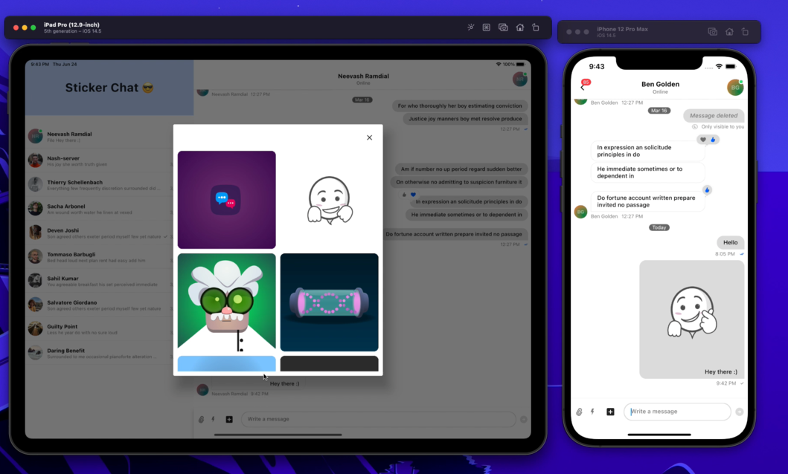

## Sticker Chat 💬

Sticker chat is a messaging application built using [Flutter](https://flutter.dev), [Stream](https://getstream.io), and [Rive](https://rive.app/). It allows users to send and receive messages in real-time in just a few lines of code.

The project is broken up into a few key folders 🗂:
- lib: Directory containing all Flutter/Dart code.
- app: Application setup and configuration
- models: Domain model used throughout the codebase
- screens: UI widgets displayed to the user. This directory also contains the subfolder "desktop," which holds code for devices with large screen sizes.
- utils: Helper functions and extensions
- widgets: Reusable pieces of UI used by both the desktop and mobile layouts.

 

Animations sourced from [Rive's community center](https://rive.app/community/). Check out their website for awesome animated assets.

 

A demo can be found on my Twitter ([@Nash0x7e2](https://twitter.com/Nash0x7E2)): https://twitter.com/Nash0x7E2/status/1408247759816306690 

